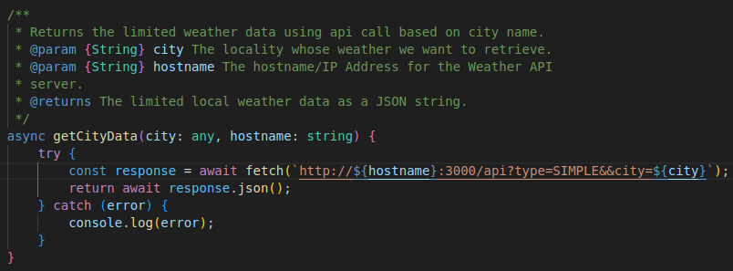

# Weather API Server
A server whose purpose is to hide the API key used by the web applications that uses Open Weather Map as a source.

## Overview
It is always important to protect your API secrets.  Especially, if you spent money acquiring rights to use that API secret.  Currently, this weather api server supports the default free type of request and the one call request.  If you feel the need to add support for additional requests types please let us know.

## Setup Instructions
1. Clone the repository
2. Run the command "npm install"
3. Create a file in the root of your project with the name "apikey.txt"
4. Paste the key into the new document.
3. Run the command "npm start"

## Example
Shown below is an example function we created in our weather application for the free fetch request.  In the URL you will see a parameter labeled "type" and given the value "SIMPLE".  This tells the weather api server what type of request to perform against Open Weather Map.  Also note the parameter for hostname.  Currently we support the use of host names and IP addresses.  In our project we use "localhost".



```
/**
     * Returns the limited weather data using api call based on city name.
     * @param {String} city The locality whose weather we want to retrieve.
     * @param {String} hostname The hostname/IP Address for the Weather API 
     * server.
     * @returns The limited local weather data as a JSON string.
     */
    async getCityData(city: any, hostname: string) {
        try {
            const response = await fetch(`http://${hostname}:3000/api?type=SIMPLE&&city=${city}`);
            return await response.json();
        } catch (error) {
            console.log(error);
        }
    }
```

An example for a one call type request is as follows:
```
/**
     * Returns the detailed weather data of the user's location or search 
     * query.
     * @param {Number} latitude The latitude of user's location or search 
     * query.
     * @param {Number} longitude The longitude of user's location or search 
     * query.
     * @param {String} hostname The hostname/IP Address for the Weather API 
     * server.
     * @returns Detailed weather data as a JSON string.
     */
    async getWeatherData(latitude: number, longitude: number, hostname: string) {

        ...   
            
        try {
            const response = await fetch(`http://${hostname}:3000/api?type=ONECALL&lat=${latitude}&lon=${longitude}&units=${units}`);
            const weatherData = await response.json();
            return weatherData;
        } catch (error) {
            console.log(error);
        }
    }
```